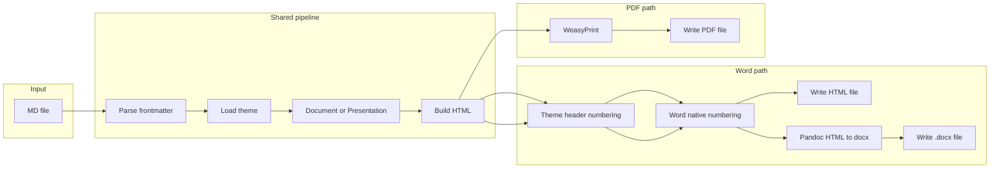

# Add Word export and skill structure

## Part A: Word export

- Extend [claude_skills/md-document/scripts/md_to_pdf.py](claude_skills/md-document/scripts/md_to_pdf.py) with `output_format` ("pdf" | "word" | "docx"). For Word output, **header numbering is defined by the theme** (e.g. `headingNumbering`, `headingNumberingMaxLevel` in theme.json); the implementation **must use Word's native header numbering system** (e.g. outline/list numbering linked to Heading 1, 2, 3 in .docx; or equivalent in HTML so Word applies its built-in numbering when opened). Do not inject static number text (e.g. "1. ", "1.1 ") into headings.
- For `--format word`: write Word-friendly HTML to a file (default `input_basename.html`). For `--format docx`: produce a native .docx from the start (see Part D). Same pipeline as PDF up to HTML; docx then generated from that HTML (e.g. via pandoc).
- Update [claude_skills/md-document/SKILL.md](claude_skills/md-document/SKILL.md) to document Word and .docx export and workflow.

---

## Part B: Directory structure for managing skills

All Claude/agent skills live under `**claude_skills/`**. Use one subdirectory per skill with a consistent layout so additional skills can be added the same way.

**Layout:**

```
markdown-live-preview/
  claude_skills/                # parent directory for all skills
    md-document/                 # one skill = one subdirectory
      SKILL.md                   # skill definition (name, description, workflow)
      README.md                  # human-facing: what it does, how to run, deps
      requirements.txt          # Python deps (if any)
      scripts/                   # runnable entry points
        md_to_pdf.py
      themes/                    # theme configs and assets (skill-specific)
        <theme-name>/
          theme.json
          assets/
      examples/                  # sample inputs for demos and tests
        *.md
      references/                # long-form reference docs (optional)
        themes.md
      tests/                     # automated tests (see Part C)
        test_*.py
        scenarios/               # or fixtures/ for test data
    (future-skill)/              # same structure for next skill
```

**Conventions:**

- **Skill identity**: Each skill lives under `claude_skills/<skill-name>/`; `SKILL.md` at the root of that directory is the single source of truth for when and how the skill is used.
- **Single parent**: All skills are grouped under `claude_skills/` for clear discovery and consistent paths (e.g. `claude_skills/md-document/scripts/md_to_pdf.py`).
- **Shared vs local**: The main app (Node, server.js) stays at repo root; skills that need Python use their own `requirements.txt` and `scripts/` so they stay self-contained.
- **Templates**: After alignment (Part E), the skill's `themes/` directory is the single source of truth; the main app loads (or syncs from) `claude_skills/md-document/themes/` so preview and export stay in sync.

---

## Part C: Testing scenarios, framework, and READMEs

### 1. Testing framework

- **Framework**: **pytest** for the Python script(s) in `claude_skills/md-document`. It's the usual choice for Python, supports fixtures and parametrization, and works well with small example files.
- **Location**: Tests live under [claude_skills/md-document/tests/](claude_skills/md-document/tests/). Add `claude_skills/md-document/requirements-dev.txt` (or extend `requirements.txt`) with `pytest` so CI or developers can install and run tests.

### 2. Test scenarios to cover

- **Frontmatter parsing**: Valid frontmatter (theme, sensitivity, mode); missing frontmatter (defaults); empty file.
- **Document mode**: MD with one `#` title and body → HTML contains title and body; Word output uses Word's native header numbering (theme-defined), not static number text.
- **Presentation mode**: MD with `---` slides → HTML contains multiple slides; optional `--narrative` changes output.
- **Output format**: `convert(..., output_format="pdf")` produces a valid PDF file; `convert(..., output_format="word")` produces an HTML file with expected content (e.g. logo, title, headings structured for Word native numbering); `convert(..., output_format="docx")` produces a valid .docx (e.g. via pandoc) with native numbering when pandoc is available.
- **CLI**: Invocation with `--format pdf|word|docx` and optional output path; default output path when format is word (e.g. `input.html`), when docx (e.g. `input.docx`).
- **Theme loading**: Use existing themes from `themes/` (or a minimal fixture theme in `tests/fixtures/` / `tests/scenarios/`) so tests don't depend on full branding assets if not needed.

Manage scenarios in one place: either **pytest parametrize** (e.g. `@pytest.mark.parametrize("mode", ["document", "presentation"])`) or a small **scenarios** list (e.g. `tests/scenarios/` with minimal .md files and expected assertions). Prefer parametrization and fixtures over many separate test files so scenarios stay visible and easy to extend.

### 3. README and docs updates

- **[claude_skills/md-document/README.md](claude_skills/md-document/README.md)** (create if missing): Short description of the skill; how to run PDF, Word (HTML), and .docx export (e.g. `python3 scripts/md_to_pdf.py input.md [out.pdf|out.html|out.docx] --format pdf|word|docx`); note that .docx requires pandoc; dependencies (`pip install -r requirements.txt`); pointer to `SKILL.md` for agent workflow and to `references/themes.md` for theme details. Add a **Testing** section: how to run tests (`pytest tests/`), that scenarios cover document/presentation and PDF/Word, and that examples in `examples/` can be used for manual checks.
- **[claude_skills/md-document/SKILL.md](claude_skills/md-document/SKILL.md)**: Already updated for Word in Part A; ensure workflow step says "Generate PDF, Word (HTML), or .docx" and that the generation section documents `--format word` (HTML) and `--format docx` (native .docx, requires pandoc). Header numbering is theme-defined and uses Word's native numbering. No need to duplicate full test instructions here.
- **Repo root [README.md](README.md)**: Optional short line under "Features" or "Project structure" that the repo includes the `claude_skills/md-document` skill for branded PDF/Word export from Markdown, with a link to `claude_skills/md-document/README.md`.

---

## Part D: .docx support (in scope from the start)

- Support **native .docx output from the start** via `--format docx`. Implementation: generate the same theme-driven HTML as for `--format word`, then convert to .docx (e.g. **pandoc**: detect `pandoc` on PATH and run `pandoc -f html -t docx -o out.docx` on the generated HTML; document pandoc as a dependency for docx). If pandoc is not available, the script should report a clear error when `--format docx` is requested.
- **Header numbering in Word**: When producing Word output (HTML or .docx), use **Word's native header numbering system**. The theme defines whether numbering is enabled and to which level (e.g. `headingNumbering`, `headingNumberingMaxLevel` in theme.json). For .docx generated via pandoc, ensure the HTML uses structure/styles that pandoc maps to Word's built-in heading styles so Word can apply its native outline numbering; alternatively, post-process the .docx (e.g. with python-docx) to attach Word's numbering definitions to Heading 1–3. Do not rely on static number text in heading content.

---

## Part E: Align templates; use skill templates to update main app

- **Single source of truth**: Treat [claude_skills/md-document/themes/](claude_skills/md-document/themes/) as the canonical location for theme definitions and assets (comotion, comotion-ai, seedanalytics). The skill's `theme.json` files and `assets/` directories are the templates the main app should use.
- **Update the main app** so it uses the skill's templates:
  - **Option A (recommended)**: Change the main app ([server.js](server.js)) to load themes from `claude_skills/md-document/themes/` (e.g. resolve theme path to `path.join(__dirname, 'claude_skills', 'md-document', 'themes', themeName)` and serve theme assets from that directory). One copy of each theme; preview and skill exports stay aligned.
  - **Option B**: Keep root `themes/` for the main app but add a sync step (script or docs) that copies from `claude_skills/md-document/themes/` into `themes/` so the main app's templates are updated from the skill. Requires maintaining sync or running it as part of release.
- **Alignment**: Ensure theme.json schema and asset paths work for both (1) the Node server (e.g. logoSrc, asset URLs under a route that serves the chosen theme directory) and (2) the Python script (themes_dir, assets next to theme.json). If the main app currently expects `logoSrc` like `/themes/comotion/assets/...`, adjust so that when loading from the skill path, asset URLs point at the same theme structure (e.g. `/themes/comotion/...` served from the skill path, or a dedicated route).
- **Result**: Adding or changing a theme in `claude_skills/md-document/themes/` automatically applies to the live preview app (and to PDF/Word export) without duplicate theme files or manual copy.

---

## File summary


| File / area                                                                                                      | Change                                                                                                                                                                                                                       |
| ---------------------------------------------------------------------------------------------------------------- | ---------------------------------------------------------------------------------------------------------------------------------------------------------------------------------------------------------------------------- |
| [claude_skills/md-document/scripts/md_to_pdf.py](claude_skills/md-document/scripts/md_to_pdf.py)                 | Add `output_format` ("pdf" | "word" | "docx"); Word path uses theme-driven **Word native header numbering** (no static number injection). For docx: generate HTML then call pandoc when available.                           |
| [claude_skills/md-document/SKILL.md](claude_skills/md-document/SKILL.md)                                         | Document Word (HTML) and .docx export; workflow "PDF, Word, or .docx"; theme defines header numbering; Word native numbering.                                                                                                |
| [claude_skills/md-document/requirements.txt](claude_skills/md-document/requirements.txt)                         | No change.                                                                                                                                                                                                                   |
| **Directory structure**                                                                                          | Document in plan and in `claude_skills/md-document/README.md`; skills live under `claude_skills/<skill-name>/`.                                                                                                              |
| [claude_skills/md-document/tests/](claude_skills/md-document/tests/)                                             | **New.** Add `test_convert.py` (or similar) with pytest tests for frontmatter, document/presentation, PDF/Word/.docx output, CLI. Optionally `tests/scenarios/` or fixtures for minimal .md.                                 |
| [claude_skills/md-document/requirements-dev.txt](claude_skills/md-document/requirements-dev.txt) or requirements | Add `pytest` for tests.                                                                                                                                                                                                      |
| [claude_skills/md-document/README.md](claude_skills/md-document/README.md)                                       | **Create or update.** Usage (PDF + Word + .docx), deps (incl. pandoc for .docx), testing section, link to SKILL.md.                                                                                                          |
| [README.md](README.md) (root)                                                                                    | Optional: one-line mention of `claude_skills/md-document` and link.                                                                                                                                                          |
| [server.js](server.js) (main app)                                                                                | **Template alignment:** Load themes from `claude_skills/md-document/themes/` (or sync from there into root `themes/`); serve theme assets so preview matches skill output. Single source of truth for theme.json and assets. |


---

## Flow (mermaid)




