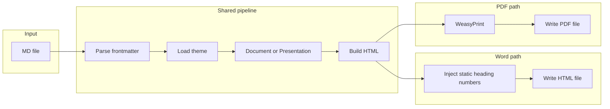

# Add Word export to md-document-skill

## Current state

- **[md-document-skill/scripts/md_to_pdf.py](md-document-skill/scripts/md_to_pdf.py)** converts Markdown to PDF: frontmatter → theme + mode (document/presentation) → built HTML → WeasyPrint → PDF. Single entry point `convert(md_path, pdf_path=None, ...)`.
- The **main app** has a "Copy to Word" button (in [server.js](server.js) ~899–1169): it builds HTML from the live DOM (logo, title, content) with **static heading numbers** (because Word ignores CSS counters), applies **tableWordStyling** inline, and copies that HTML to the clipboard for paste into Word. There is no .docx file export in the app; the `docx` npm dependency exists but is unused.

## Goal

Enable the skill to "convert to Word in the same way" as the Copy to Word behavior: same themed output (logo, sensitivity, fonts, table styling) and **static heading numbering**, but as a **file** that Word can open (Word-openable HTML), not clipboard.

## Approach

Reuse the existing PDF pipeline up to HTML generation, then for Word write that HTML to a file instead of passing it to WeasyPrint. Apply one Word-specific change: **inject static heading numbers** into the document body (like the main app’s `addWordHeadingNumbering`) so numbering appears in Word. Keep using the same theme, `tableWordStyling`, and document/presentation builders.

## Implementation

### 1. Add Word-friendly HTML for document mode (static heading numbers)

- In [md-document-skill/scripts/md_to_pdf.py](md-document-skill/scripts/md_to_pdf.py), add a helper that post-processes `body_html` to insert explicit numbering before each `h1`/`h2`/`h3` (e.g. `1.` , `1.1` , `1.2.3` ) so Word shows numbers without relying on CSS counters.
- Respect theme `headingNumbering` / `headingNumberingMaxLevel` if present (same semantics as the main app); otherwise default to numbering on (max level 3).
- Implementation option: use regex or a small stateful pass over the HTML to find `<h1>`, `<h2>`, `<h3>` (and optional `class="doc-title"` skip for the main title) and insert a `...` with the number before the heading content, mirroring the main app’s `data-word-numbering` approach.

### 2. Extend `convert()` to support PDF vs Word output

- Add a parameter `output_format` (e.g. `"pdf"` | `"word"`) to `convert()`. Default `"pdf"` for backward compatibility.
- When `output_format == "pdf"`: keep current behavior (WeasyPrint → PDF).
- When `output_format == "word"`:
  - **Document mode**: build HTML via existing `build_document_html()`, then run the new static-numbering pass on the content div’s inner HTML, and write the full HTML string to the output path (no WeasyPrint).
  - **Presentation mode**: use existing `build_presentation_html()` and write that HTML to the output path (presentation HTML is already self-contained; optional: add static numbering for any headings inside slides if desired for consistency).
- Output path: when the second CLI argument is omitted and format is word, default to `os.path.splitext(md_path)[0] + ".html"` (Word can open .html). If the user passes a path, use it (e.g. `output.doc` or `output.html`).

### 3. CLI and script interface

- Add `--format` (or `--output-format`) with choices `pdf` | `word`, default `pdf`.
- If `--format word` and no output argument, set output to `input_basename.html`.
- After conversion, print the same style message: e.g. `"Word document written: ..."` or `"PDF written: ..."` depending on format.

### 4. Dependencies and files

- **No new Python dependencies**: Word output is HTML written to a file; no need for python-docx or pandoc in the minimal solution.
- **requirements.txt**: unchanged (markdown, weasyprint for PDF only).
- **SKILL.md**: update workflow and "PDF Generation" (or add "Word export") to document that users can run the script with `--format word` to produce a Word-openable HTML file, and that they should open the resulting `.html` in Microsoft Word. Optionally mention that heading numbering and table styling match the in-app "Copy to Word" behavior.

### 5. .docx via pandoc (out of scope for minimal plan)

- The script could detect `pandoc` and offer `--format docx` that runs `pandoc -f html -t docx` on the generated HTML to produce a .docx. Not required for "same way as export to Word" (Copy to Word is HTML).  If pandoc is not installed, install it in the environment.

## File summary

| File                                                                             | Change                                                                                                                                                          |
| -------------------------------------------------------------------------------- | --------------------------------------------------------------------------------------------------------------------------------------------------------------- |
| [md-document-skill/scripts/md_to_pdf.py](md-document-skill/scripts/md_to_pdf.py) | Add static heading-number injection helper; add `output_format` to `convert()`; branch on format (WeasyPrint vs write HTML); extend argparse with `--format pdf |
| [md-document-skill/SKILL.md](md-document-skill/SKILL.md)                         | Document Word export: `--format word`, default output `.html`, open in Word; align workflow step (e.g. "Generate PDF or Word") and any PDF Generation section.  |
| [md-document-skill/requirements.txt](md-document-skill/requirements.txt)         | No change.                                                                                                                                                      |

## Flow (mermaid)

## Testing (manual)

- Run `python3 md_to_pdf.py examples/seedanalytics-document-example.md out.html --format word` and open `out.html` in Word: check theme, logo, title, numbered headings, and table styling.
- Run existing PDF command without `--format` and confirm behavior unchanged.

