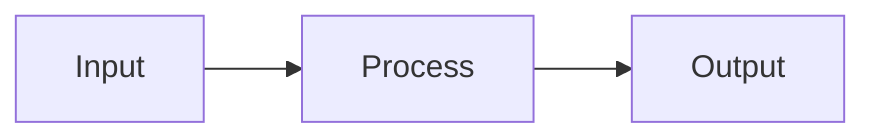

# Presentation Title
Subtitle — Comotion Business Solutions

---

## Slide Title

- **Point one** — detail
- **Point two** — detail
- **Point three** — detail

---

## Metrics

| Metric | Actual | Target |
|--------|--------|--------|
| Example | — | — |

---

<!-- layout: divider -->
## Section Break

---

## Rich elements — callouts

> [!TIP]
> Use callouts for emphasis without breaking the slide rhythm.

> [!WARNING]
> Align messaging with your sensitivity classification before sharing externally.

---

## Rich elements — KPI stat block

:::stat
# 42%
Increase in conversion rate
- Driven by A/B testing
- Mobile-first redesign
:::

---

## Rich elements — flow with arrows

:::flow
Discovery | Analysis | Strategy | Action
:::

---

## Rich elements — two columns

:::columns
**Challenges**
- Legacy infrastructure
- Siloed teams
|||
**Solutions**
- Modern API layer
- Cross-functional squads
:::

---

## Rich elements — pull quote

> "Strategy without execution is a daydream."

---

## Diagrams and charts



```chart
{
  "type": "bar",
  "data": {
    "labels": ["Q1", "Q2", "Q3"],
    "datasets": [{ "label": "Revenue", "data": [12, 19, 14] }]
  },
  "options": { "plugins": { "legend": { "display": true } } }
}
```

---

## Thank You

Questions and discussion.
